<p align="center">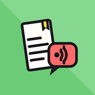</p>

# LeggiMi

**Listen to your documents.** LeggiMi is an Android app that turns almost anything into text and reads it aloud: PDFs, Word files, Markdown, plain text, **photos of paper pages**, **scanned documents**, **voice recordings**, and whatever other apps can **share** or **print**. It highlights each block as it speaks, like karaoke for documents, and keeps everything in a Library so you can pick up where you stopped.

Recognition happens **on the phone**: OCR, speech-to-text, PDF extraction and page processing run locally. Nothing is uploaded unless you choose to export to your own cloud.

It wears the same comic look as its sibling app *Pay & Plan*.

---

## Contents

- [What it looks like](#what-it-looks-like)
- [Features](#features)
- [Privacy: what stays on the phone](#privacy-what-stays-on-the-phone)
- [Using the app](#using-the-app)
- [Cloud export setup](#cloud-export-setup)
- [How it works](#how-it-works)
- [Building](#building)
- [Project structure](#project-structure)
- [Tech stack](#tech-stack)
- [Support](#support)
- [Notes and limits](#notes-and-limits)

---

## What it looks like

<table>
  <tr>
    <td align="center">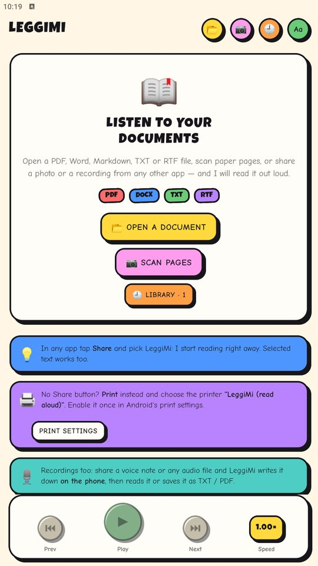<br><sub><b>Home</b> — open, scan, share, print or record</sub></td>
    <td align="center"><br><sub><b>Reading a PDF</b> — the block being spoken is a yellow sticker</sub></td>
    <td align="center"><br><sub><b>Shared text</b> — Markdown headings, lists, quotes</sub></td>
  </tr>
  <tr>
    <td align="center">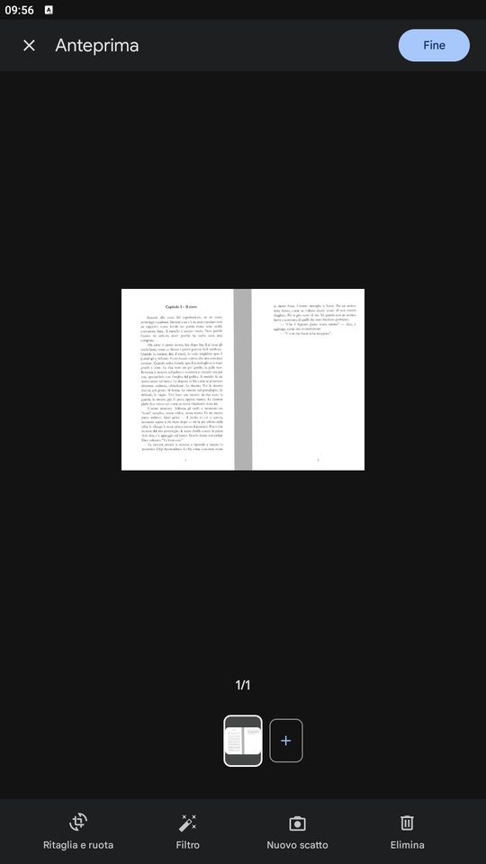<br><sub><b>Camera scanner</b> — auto edges, crop, filters, many pages</sub></td>
    <td align="center">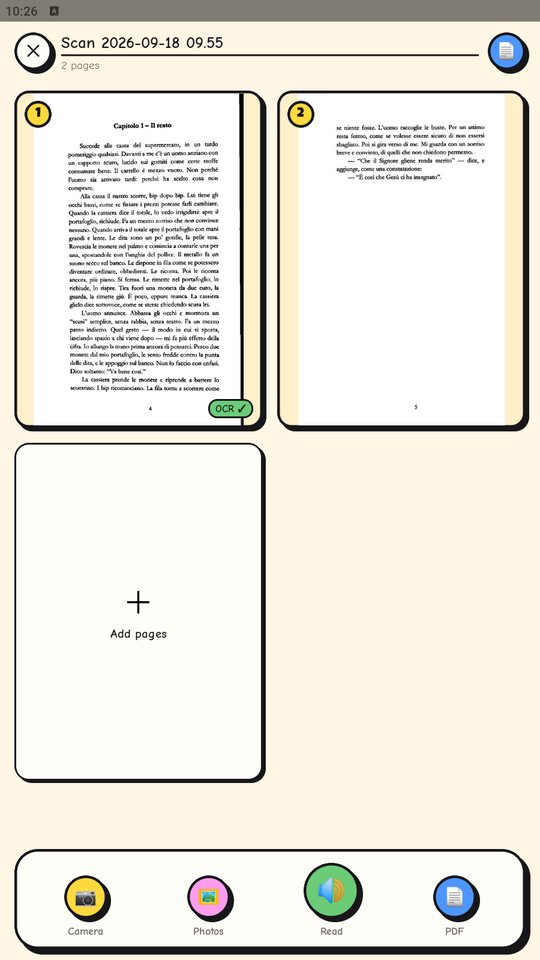<br><sub><b>Scan studio</b> — your pages, add more, read, export</sub></td>
    <td align="center">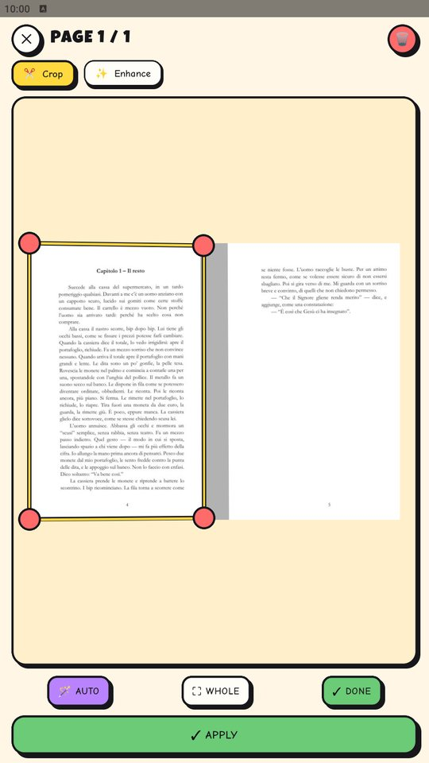<br><sub><b>Crop</b> — drag the corners, a magnifier helps</sub></td>
  </tr>
  <tr>
    <td align="center">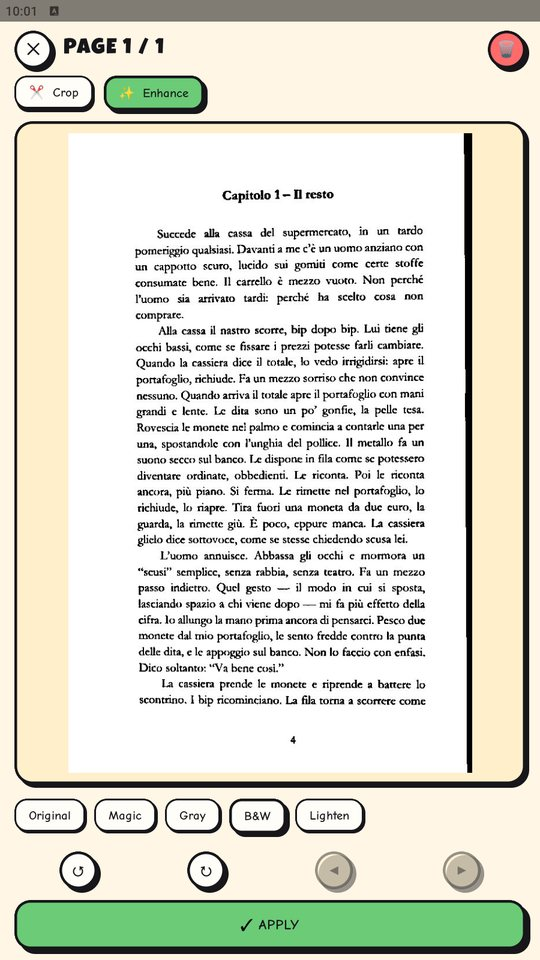<br><sub><b>Enhance</b> — straightened page, B&amp;W filter</sub></td>
    <td align="center">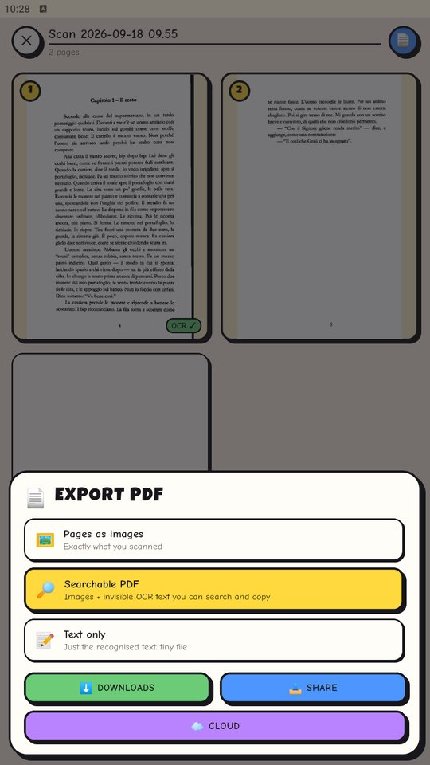<br><sub><b>Export PDF</b> — images, searchable, text only</sub></td>
    <td align="center">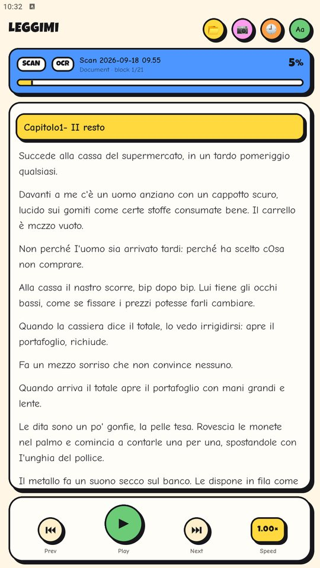<br><sub><b>OCR</b> — the scan read aloud</sub></td>
  </tr>
  <tr>
    <td align="center">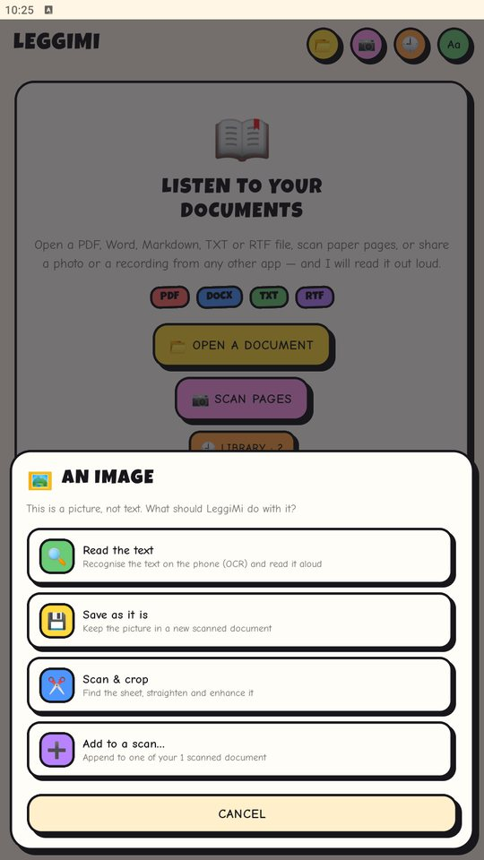<br><sub><b>A shared picture</b> — OCR, keep, crop or add to a scan</sub></td>
    <td align="center">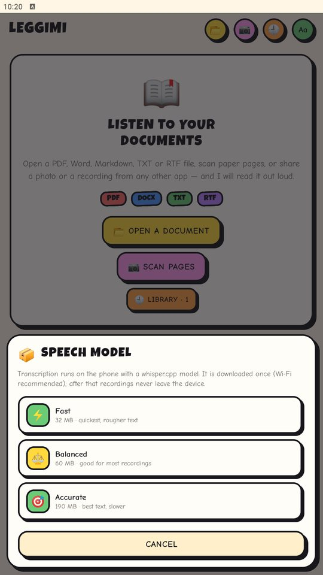<br><sub><b>Speech model</b> — whisper.cpp, downloaded once</sub></td>
    <td align="center">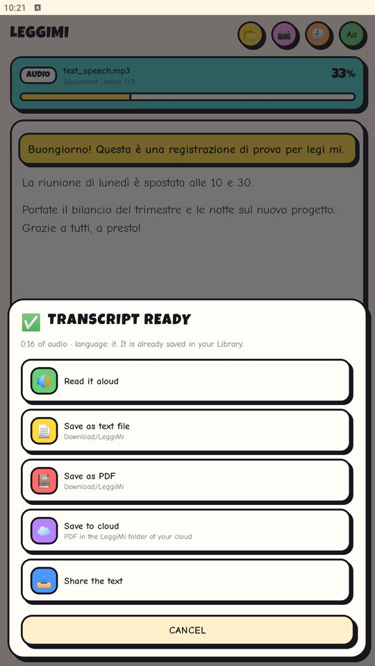<br><sub><b>Recording transcribed</b> — read, save TXT/PDF, cloud</sub></td>
  </tr>
  <tr>
    <td align="center">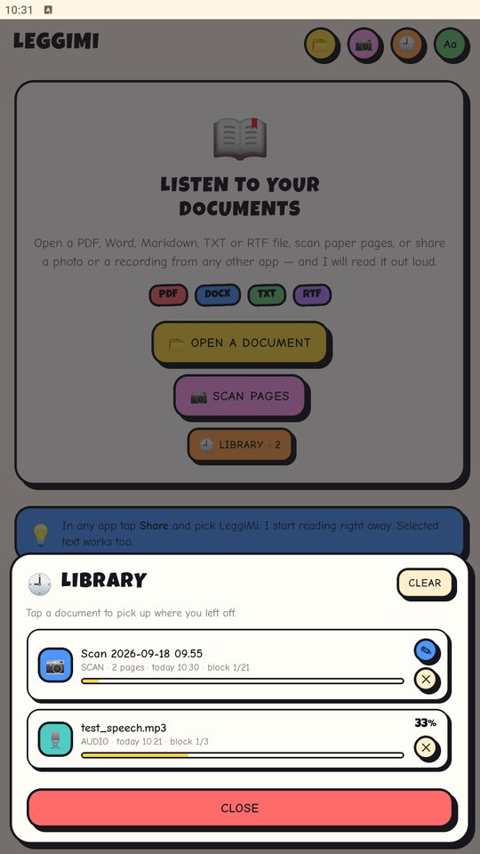<br><sub><b>Library</b> — every document with its progress</sub></td>
    <td align="center">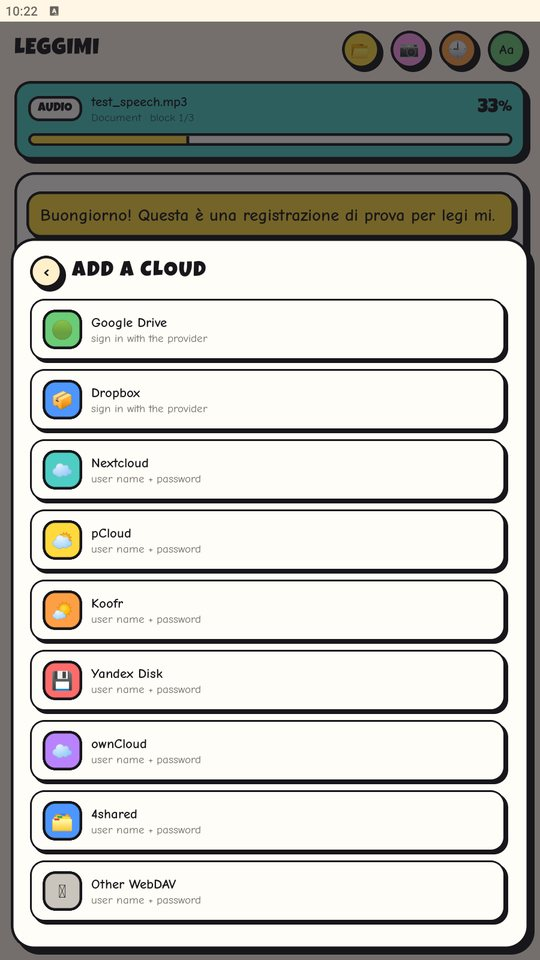<br><sub><b>Cloud accounts</b> — Google Drive, Dropbox, WebDAV clouds</sub></td>
    <td align="center">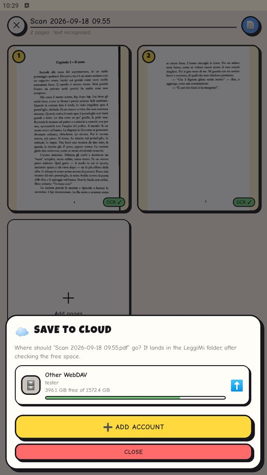<br><sub><b>Save to cloud</b> — into a “LeggiMi” folder, space checked</sub></td>
  </tr>
</table>

---

## Features

### Reading
- **Many formats**: PDF, DOCX (Word), RTF, TXT, Markdown and other plain-text files.
- **Block karaoke**: the block being spoken turns into a yellow sticker and the view follows along. Tap any block to read from there.
- **Readable blocks**: text is split into Markdown-aware blocks. Headings, bullet and numbered lists, quotes, bold, italic, code and links are rendered; the voice reads clean text.
- **Smart PDF extraction**: lines and paragraphs are rebuilt from glyph positions, so chapter titles are recognised. Tables of contents, page numbers and repeated headers are dropped. Lines wrapped by the page layout are joined back into sentences.
- **Chapters**: detected headings (or evenly split parts) in a slide-up index.
- **Voices**: every installed TTS voice, the phone's language first, with a one-tap preview.
- **Comfort**: comic-style light, sepia and dark themes, adjustable text size, speed from 0.5× to 2×.

### Getting documents in
- **Open** any file with the 📂 button.
- **Share** a file, several pictures, or just selected text from any app.
- **Print** from apps without a Share button: pick the virtual printer **“LeggiMi (read aloud)”**.
- **Scan** paper pages with the camera (📷).
- **Record** elsewhere and share the audio file: LeggiMi transcribes it.

### Scanner (CamScanner-style)
- **Capture** with Google's on-device document scanner: automatic edge detection, auto-capture, manual corner adjustment, filters, stain and finger removal, many pages in one go, import from the gallery.
- **Page editor** for every page, at any time:
  - **Crop** with four draggable corners and a magnifier, **Auto** sheet detection, **Whole page**.
  - **Perspective correction**: the quadrilateral is warped into a straight rectangle.
  - **Filters**: Original, Magic (white balance and levels), Gray, B&amp;W (adaptive threshold), Lighten.
  - **Rotate** left or right, **reorder** pages, **delete** a page.
- **Multi-page documents**: add pages from the camera or from photos whenever you like. Rename the document.
- **Read aloud**: OCR of every page, then straight into the reader.
- **Export PDF** in three flavours:
  - **Pages as images**: exactly what you scanned, JPEG pages on A4.
  - **Searchable PDF**: the images plus an invisible OCR text layer placed over the words, so the PDF can be searched, selected and copied.
  - **Text only**: just the recognised text, typeset on A4, a tiny file.
- **Save first, then send**: every export is saved in Download/LeggiMi under the name you choose. Only then can you also upload it to your cloud or share it to another app.

### Pictures shared from other apps
LeggiMi asks what to do:
- **Read the text**: OCR on the phone, then read aloud.
- **Save as it is**: keep the picture in a new scanned document.
- **Scan &amp; crop**: find the sheet, straighten and enhance it.
- **Add to a scan…**: append the picture(s) to one of your scanned documents.

### Recordings
Share a voice note or any audio file (mp3, m4a/aac, ogg/opus, flac, wav, amr, 3gp, the audio of a video…). LeggiMi offers to **transcribe it on the phone** with whisper.cpp. Then you can read it aloud or save it as TXT or PDF in Download/LeggiMi; after saving you can also send it to the cloud or share it. It is kept in the Library either way. Pauses in the speech start new paragraphs, and the language is detected automatically.

### Library
Everything you opened, shared, printed, scanned, OCR'd or transcribed is kept with an icon per type, the date and how far you got. The 📤 button on each row saves the document (text as PDF or TXT, or the scanned pages as PDF) in Download/LeggiMi and then offers the cloud or sharing; ☁️ opens the cloud accounts. Reopening is instant because the clean text is cached: no second extraction, OCR or transcription. Scans keep their pages and can be edited again (✎).

### Cloud export
Exports go into a folder called **LeggiMi** in your cloud, and **free space is checked before every upload**.

> For now the app offers **Google Drive** only. Dropbox and the WebDAV clouds below are implemented (WebDAV is tested) and will be switched back on in a later version (`PROVIDER_ORDER` in `src/cloud/cloud.ts`).
- **Google Drive**: sign in with Google.
- **Dropbox**: sign in with Dropbox.
- **User name + password** (WebDAV): Nextcloud, ownCloud, pCloud, Koofr, Yandex Disk, 4shared and any other WebDAV server (Synology or QNAP NAS, MagentaCLOUD, GMX, Web.de, Infomaniak kDrive…).

Every cloud operation has a timeout and a **Cancel** button, so a missing connection never leaves the app waiting. Passwords and tokens are encrypted with a key held by the Android Keystore. They are never stored in plain text and never leave the phone except to talk to your cloud.

---

## Privacy: what stays on the phone

| Feature | Where it runs | Network |
|---|---|---|
| PDF / DOCX / text extraction | on the phone | none |
| OCR (images, scans, scanned PDFs) | on the phone (ML Kit) | none |
| Page crop, perspective, filters, PDF creation | on the phone | none |
| Speech-to-text of recordings | on the phone (whisper.cpp) | the model is downloaded **once** (32–190 MB) |
| Camera scanner | on the phone (Google Play services) | Play services fetches the scanner module on first use |
| Text-to-speech | the phone's TTS engine | depends on the voice you pick (“needs a connection” is shown) |
| Cloud export | your cloud | only when you press **Cloud** |

The app needs no storage permission on Android 10+. On Android 9 it asks for it only to save exports in the public Download folder.

---

## Using the app

### Reading
1. Tap 📂 to open a file, or share one to LeggiMi from any app.
2. Press ▶ to start. Tap any block to jump there.
3. **⚙️** opens the settings: cloud accounts (first), theme, text size, speed, voice, speech model.
4. ☰ opens the chapter index. 🕘 opens the Library.

### Printing to LeggiMi
From any app choose **Print** and select the printer **LeggiMi (read aloud)**. Enable the service once in Android Settings › Connected devices › Connection preferences › Printing › LeggiMi. The **Print settings** button on the home screen takes you there.

Android does not let a print service open an app by itself. LeggiMi posts a **“Ready to read”** notification you can tap, or you can simply open LeggiMi and the printed document starts on its own.

### Scanning
1. Tap 📷 (or **Scan pages**). The camera scanner opens: frame the sheet and let it capture, or shoot manually. Adjust the corners, pick a filter, add more pages, then **Done**.
2. In the **Scan studio** tap a page to open the editor.
   - **Crop**: drag the corners, or tap **Auto** / **Whole**.
   - **Enhance**: choose a filter, rotate, move the page left or right, then **Apply**.
3. Add more pages at any time with **Camera** or **Photos**.
4. **Read** runs OCR on all pages and starts reading.
5. **PDF**: pick the file name and the kind of PDF (images, searchable or text), then **Save PDF**. It lands in Download/LeggiMi; the next screen offers **Cloud**, **Share** or **Done**.

Scans live in the Library. Tap a scan to read it, or ✎ to edit its pages.

### Pictures and recordings
Share a picture and pick one of the four options. Share a recording and choose **Transcribe to text**. The first time, choose a speech model:

| Model | Size | Notes |
|---|---|---|
| Fast | 32 MB | quickest, rougher text |
| Balanced | 60 MB | good for most recordings (default) |
| Accurate | 190 MB | best text, slower |

You can change it later in **⚙️ › Speech to text**.

### Voices
LeggiMi reads with the phone's language by default. Go to **⚙️ › Voice** to choose another voice. Voices are listed as “Language · code”, with the phone's language first. Tap one to hear a preview. **Install more voices…** opens Android's text-to-speech settings.

---

## Cloud export setup

### Why no user name and password for Google Drive and Dropbox?
Google and Dropbox do not accept a user name and password from third-party apps. Their APIs only allow **OAuth**: you sign in on their own page, and the app receives a limited token. This is safer: LeggiMi never sees your Google or Dropbox password, and you can revoke access from your account at any time.

User name and password **do** work with WebDAV clouds, listed below.

### WebDAV clouds (user name + password)

| Provider | Address used | Notes |
|---|---|---|
| Nextcloud | `https://<server>/remote.php/dav/files/<user>/` | with two-factor login use an app password (Settings › Security) |
| ownCloud | `https://<server>/remote.php/webdav/` | |
| pCloud | `https://ewebdav.pcloud.com/` (EU) · `https://webdav.pcloud.com/` (US) | pick the region of your account |
| Koofr | `https://app.koofr.net/dav/Koofr/` | needs an app password |
| Yandex Disk | `https://webdav.yandex.com/` | needs an app password for “Files (WebDAV)” |
| 4shared | `https://webdav.4shared.com/` | |
| Other WebDAV | full address | NAS, MagentaCLOUD, GMX, Web.de, Infomaniak kDrive… |

LeggiMi checks the login, reads the free space (RFC 4331 quota), creates the **LeggiMi** folder and stores the password encrypted. HTTPS is required, except towards the phone itself.

### Google Drive
Google only lets an app use Drive after the app is registered in a Google Cloud project. This is a one-time task for whoever builds the APK:
1. In the [Google Cloud console](https://console.cloud.google.com/) create a project and enable the **Google Drive API**.
2. Configure the **OAuth consent screen** (External, add yourself as a test user) with the scope `.../auth/drive.file`.
3. Create an **OAuth client ID** of type **Android** with package name `com.leggimimobile` and the **SHA-1** of the certificate that signs your APK:
   ```sh
   keytool -list -v -keystore android/app/debug.keystore -storepass android -alias androiddebugkey
   ```
4. Build and install. **⚙️ › Cloud accounts › Add account › Google Drive** then shows Google's sign-in.

LeggiMi asks only for the `drive.file` scope: it can see and create **only its own files** (the LeggiMi folder), not the rest of your Drive.

### Dropbox
1. Open [dropbox.com/developers/apps](https://www.dropbox.com/developers/apps) › **Create app** › *Scoped access* › *App folder*.
2. Permissions: `files.content.write`, `files.content.read`, `account_info.read`.
3. Settings › Redirect URIs: add `http://localhost:53682/`.
4. Copy the **App key** into **⚙️ › Cloud accounts › Add account › Dropbox** and press **Connect**. Dropbox's page opens in the browser, and LeggiMi catches the answer on the phone.

The sign-in uses OAuth 2 with PKCE, so no app secret is stored in the app. With an *App folder* app, files go to `Apps/<your app>/LeggiMi`.

---

## How it works

- **PDF**: text is extracted on the phone by [pdf.js](https://mozilla.github.io/pdf.js/) in a hidden, offline WebView (`android/app/src/main/assets/pdfjs/`). Lines and paragraphs are rebuilt from the text-run coordinates. For scanned PDFs the same WebView renders each page to a canvas for OCR.
- **DOCX**: unzipped with [JSZip](https://stuk.github.io/jszip/), text taken from `word/document.xml`.
- **OCR**: [@react-native-ml-kit/text-recognition](https://github.com/a7medev/react-native-mlkit) (Google ML Kit, on device). Line boxes are kept to build searchable PDFs. B&amp;W pages are recognised from a grey rendering of the same page, because hard thresholding loses thin strokes.
- **Scanner**: capture uses Google ML Kit **Document Scanner** (Play services). The editor is LeggiMi's own (`src/scan/ScanStudio.tsx`) and the image work is native Kotlin (`scan/ImageOps.kt`):
  - EXIF-aware decoding.
  - Sheet detection: Otsu threshold, largest bright low-saturation blob, convex hull, largest inscribed quadrilateral.
  - Perspective warp with `Matrix.setPolyToPoly`.
  - Filters: per-channel levels, grey, Bradley adaptive threshold, gamma.
- **PDF writer**: a small PDF 1.4 writer in Kotlin (`scan/PdfMaker.kt`). It embeds the JPEG pages as-is (DCTDecode), so files stay small. The searchable layer is Helvetica text in render mode 3 (invisible), sized and horizontally scaled over each OCR line.
- **Speech-to-text**: the native `AudioDecoder.kt` decodes any audio Android can play with `MediaExtractor` + `MediaCodec`, then downmixes and resamples it to 16 kHz mono WAV. [whisper.rn](https://github.com/mybigday/whisper.rn) (whisper.cpp) transcribes it with automatic language detection. Models come from the official [whisper.cpp repository](https://huggingface.co/ggerganov/whisper.cpp).
- **Printing**: `LeggiMiPrintService` (a `PrintService`) advertises one printer. Android renders the printed content to a PDF; the service stores it and hands it to the app through a `FileProvider`, like a shared file.
- **Sharing**: [react-native-receive-sharing-intent](https://github.com/Sairyss/react-native-receive-sharing-intent) plus a few retries after start, because the library asks only once and can lose shares on a cold start.
- **Library**: a JSON list in AsyncStorage plus the cleaned text of each document (`files/library/<hash>.txt`). Scans are stored as JSON with their page images in `files/scans/<id>/`.
- **Cloud**: `cloud/LeggiMiCloudModule.kt` with OkHttp: WebDAV `PROPFIND`/`MKCOL`/`PUT`, Drive REST v3 multipart upload, Dropbox API v2. `SecretStore.kt` encrypts secrets with AES-256-GCM using a non-exportable Android Keystore key.

---

## Building

### Prerequisites
- Node.js ≥ 20
- JDK 17+ (21 works)
- Android SDK with **NDK and CMake** (whisper.cpp is compiled from source)
- An Android device or emulator

See the [React Native environment setup](https://reactnative.dev/docs/set-up-your-environment).

### Install and run (debug)
```sh
npm install
npm start          # Metro
npm run android    # in another terminal
```

### Release APK
```sh
cd android
./gradlew assembleRelease          # Windows: .\gradlew.bat assembleRelease
adb -s <deviceId> install -r app/build/outputs/apk/release/app-release.apk
```
The first build compiles whisper.cpp for four ABIs and takes a few minutes. The APK is about 110 MB because it carries the native libraries for all ABIs; building for your ABI only (`-PreactNativeArchitectures=arm64-v8a`) makes it much smaller.

> **Signing**: the `release` build type is signed with the React Native **debug keystore**, which is public. That is fine for personal use. Before giving the APK to others, create your own keystore and update `signingConfigs` in `android/app/build.gradle`. If you enable Google Drive, register the SHA-1 of the key you actually use.

---

## Project structure

```
App.tsx                               # reader, library, share/print/open flows, settings
src/comic.tsx                         # the comic UI kit (palette, fonts, ComicBox, buttons, chips)
src/scan/ScanStudio.tsx               # scanner workspace: pages, crop editor, filters, export
src/scan/store.ts                     # scanned documents, OCR, bridge to the native scanner
src/audio/transcribe.ts               # speech models, audio decoding, whisper transcription
src/cloud/cloud.ts, CloudSheet.tsx    # cloud providers, accounts, upload sheet
android/app/src/main/java/com/leggimimobile/
  MainActivity.kt, MainApplication.kt
  print/LeggiMiPrintService.kt        # the virtual printer
  scan/LeggiMiScanModule.kt           # ML Kit scanner, image processing, PDF, save & share, audio
  scan/ImageOps.kt                    # detection, perspective, filters
  scan/PdfMaker.kt                    # image / searchable / text PDF writer
  scan/AudioDecoder.kt                # any audio -> 16 kHz mono WAV
  cloud/LeggiMiCloudModule.kt         # WebDAV, Google Drive, Dropbox
  cloud/SecretStore.kt                # Keystore-encrypted secrets
android/app/src/main/assets/pdfjs/    # offline pdf.js
android/app/src/main/assets/fonts/    # Luckiest Guy + Comic Neue
android/app/src/main/res/drawable/ic_launcher_*.xml   # adaptive launcher icon
docs/icon/generate_icons.py           # renders the icon to the legacy PNGs
```

---

## Tech stack

React Native 0.83 (New Architecture, Hermes) · Kotlin · react-native-tts · pdf.js · JSZip · Google ML Kit (Text Recognition, Document Scanner) · whisper.cpp via whisper.rn · OkHttp · Google Identity (Authorization API) · Android PrintService · react-native-receive-sharing-intent · react-native-webview · AsyncStorage · react-native-fs · react-native-safe-area-context.

Fonts: [Luckiest Guy](https://fonts.google.com/specimen/Luckiest+Guy) and [Comic Neue](https://fonts.google.com/specimen/Comic+Neue) (SIL Open Font License).

---

## Support

If this saved you an argument about who forgot the water bill:

[](https://www.paypal.com/donate/?hosted_button_id=T4SKREGYTG5ES)

---

## Notes and limits

- OCR quality depends on the photo: good light and a flat sheet help. Pages with the B&amp;W filter are recognised from a grey version automatically.
- The camera scanner needs Google Play services. Without them, use **Photos** in the scan studio: pictures are imported, auto-cropped and can be edited the same way.
- Transcription speed depends on the phone and the model. On older phones pick “Fast”; switch to “Accurate” when the text matters more than the wait.
- Links shared to LeggiMi are not fetched: share the page text or a file instead.
- Google Drive needs the one-time Google Cloud registration described above. Until then it shows an explanatory message.
