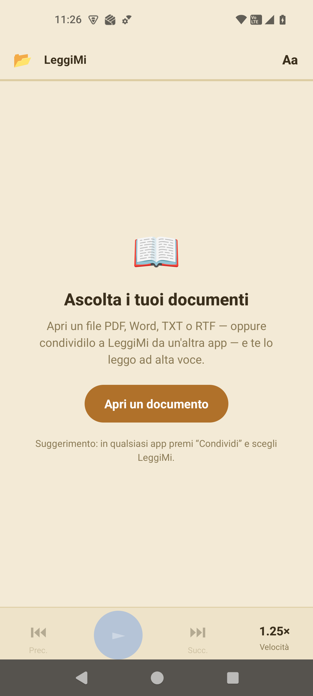
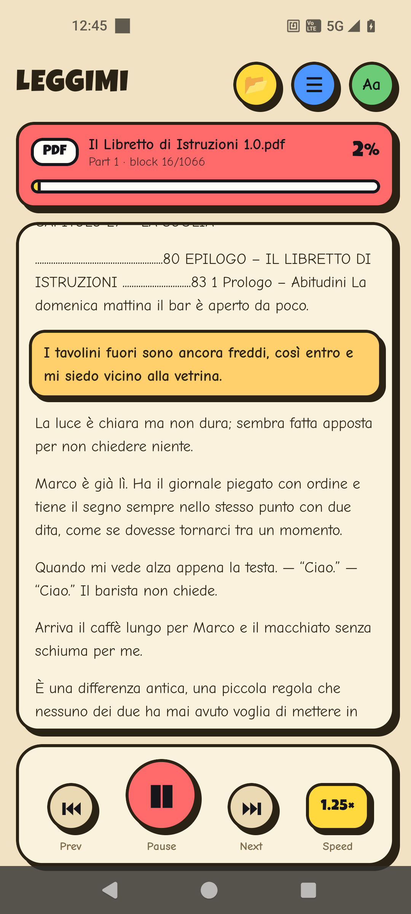
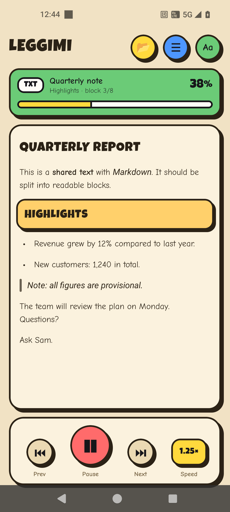

# LeggiMi

**Listen to your documents.** LeggiMi is an offline text‑to‑speech reader for Android: open (or *share*) a PDF, Word, Markdown, TXT or RTF file — or plain text from any app — and it reads it aloud, highlighting each block as it goes — like karaoke for documents. It wears the same comic look as its sibling app *Pay & Plan*.

<p align="center">
  
  
  
</p>

## Features

- **Reads many formats** — PDF, DOCX (Word), RTF, TXT, Markdown and other plain‑text files.
- **Share from any app** — send a file, or just selected text, to LeggiMi from another app and it opens and starts reading automatically.
- **Print to LeggiMi** — apps without a Share button can *Print*: pick the virtual printer **“LeggiMi (read aloud)”** and the page is read instead of printed (enable the print service once in Android's print settings).
- **OCR for images and scans** — photos, screenshots and image‑only PDFs have no text layer; LeggiMi says so and offers on‑device text recognition (Google ML Kit, no internet), page by page.
- **Library** — everything you opened, shared, printed or OCR'd is kept in a history with an icon per type, the date and how far you got; tap to resume instantly from the cached text.
- **Block karaoke** — the block being spoken becomes a yellow sticker and the view auto‑scrolls to follow along; tap any block to start reading from there.
- **Readable blocks** — documents are split into Markdown‑aware blocks: headings, bullet and numbered lists, quotes, bold / italic / code / links are rendered, while the voice reads the clean text.
- **Comfortable reader** — comic‑style light / sepia / dark themes (Luckiest Guy + Comic Neue) and an adjustable text size.
- **Playback controls** — play / pause, previous / next block, and a one‑tap speed control (0.75×–2.0×).
- **Resume where you left off** — reading position is saved per document.
- **Chapter / section index** — auto‑detected headings (or evenly split parts) in a slide‑up table of contents.
- **Pick your voice** — choose among all TTS voices installed on the phone (the phone's language first), preview them with one tap, or install more.
- **Works offline** — text extraction (including PDF) runs entirely on the device; no network required.

## How it works

- **PDF** — text is extracted on‑device by [pdf.js](https://mozilla.github.io/pdf.js/) running in a hidden, offline WebView (the library ships in `android/app/src/main/assets/pdfjs/`). Lines and paragraphs are rebuilt from the glyph positions, so chapter titles are recognised and tables of contents, page numbers and repeated headers are dropped; lines wrapped by the page layout are joined back into sentences.
- **DOCX** — the `.docx` archive is unzipped with [JSZip](https://stuk.github.io/jszip/) and text is pulled from `word/document.xml`.
- **RTF / TXT / Markdown** — read directly; Markdown syntax is honoured (headings open chapters, list items become their own blocks). Text extracted from PDF/DOCX gets de‑hyphenation, header/footer and page‑number removal, and detected titles are promoted to headings.
- **Speech** — each block is stripped of Markdown syntax and spoken with the device's TTS engine via [react-native-tts](https://github.com/ak1394/react-native-tts). The default reading language is the phone's locale; pick any installed voice to override it.
- **Printing** — `LeggiMiPrintService` (a `PrintService`) advertises one printer; Android renders the printed content to a PDF, the service stores it in the app cache and hands it to the app through a `FileProvider` URI, exactly like a shared file.
- **OCR** — [@react-native-ml-kit/text-recognition](https://github.com/a7medev/react-native-mlkit) runs on device. Scanned PDFs are rendered page by page to a canvas by pdf.js inside the hidden WebView, each bitmap is recognised, and the result goes through the same clean‑up as any extracted text.
- **Library** — a JSON list in AsyncStorage plus the cleaned text of each document under the app's files directory (`library/<hash>.txt`), so reopening never re‑extracts or re‑OCRs.
- **Sharing** — incoming files and text are received with [react-native-receive-sharing-intent](https://github.com/Sairyss/react-native-receive-sharing-intent); the activity uses `singleTask` + `onNewIntent`, and the app polls the native module a few times after start (the library asks only once, which loses shares on a cold start), so shares are caught whether the app is closed or already open.

## Getting started

### Prerequisites
- Node.js ≥ 20
- JDK 17+
- Android SDK (and an Android device or emulator). Set up your environment per the [React Native docs](https://reactnative.dev/docs/set-up-your-environment).

### Install dependencies
```sh
npm install
```

### Run (debug)
```sh
# start the Metro bundler
npm start

# in another terminal, build & launch on a connected device/emulator
npm run android
# with multiple devices: npx react-native run-android --deviceId <id>
```

### Build a release APK
The `release` build type is signed with the bundled debug keystore, so it produces a self‑contained, installable APK out of the box.
```sh
cd android
./gradlew assembleRelease          # Windows: .\gradlew.bat assembleRelease
# install on a specific device
adb -s <deviceId> install -r app/build/outputs/apk/release/app-release.apk
```
The output APK is at `android/app/build/outputs/apk/release/app-release.apk`.

> Tip: in Android Studio you can simply open the `android/` folder and press **Run** to build and deploy to your device.

## Using the app

1. Tap the 📂 button (top‑right) to open a document, or **Share** a file — or selected text — to LeggiMi from any other app.
2. Press **▶** to start; tap any block to jump there.
3. Tap **Aa** (top‑right) for theme, text size, reading speed and **voice**.
4. The **☰** icon opens the chapter/section index when available.
5. **🕘** opens the Library: your history with progress bars; tap a row to resume, ✕ to forget it.

### Printing to LeggiMi
From any app choose **Print**, then select the printer **LeggiMi (read aloud)**. The first time, enable the service: Android Settings › Connected devices › Connection preferences › Printing › LeggiMi (the **Print settings** button on the home screen takes you there).

### OCR
Open or share a photo / screenshot / scanned PDF: LeggiMi tells you there is no text and asks whether to run OCR. Recognition happens on the phone; the text is then read and cached in the Library.

### Voices
LeggiMi reads with the phone's language by default. To choose or add a voice: **Aa → Voice**. Voices are listed as “Language · code” with the phone's language first; tap one to hear a short preview, your choice is saved automatically. Use **“Install more voices…”** to download additional / higher‑quality voices from Android's text‑to‑speech settings.

## Support

If this saved you an argument about who forgot the water bill:

[](https://www.paypal.com/donate/?hosted_button_id=T4SKREGYTG5ES)

## Tech stack

React Native 0.83 (New Architecture / Fabric, Hermes) · react-native-tts · pdf.js · JSZip · react-native-receive-sharing-intent · react-native-webview · @react-native-ml-kit/text-recognition (Google ML Kit, on device) · AsyncStorage · react-native-safe-area-context · Android PrintService API. Fonts: [Luckiest Guy](https://fonts.google.com/specimen/Luckiest+Guy) and [Comic Neue](https://fonts.google.com/specimen/Comic+Neue) (OFL), bundled in `android/app/src/main/assets/fonts/`.

## Project structure

```
App.tsx                         # the entire app (UI, extraction, TTS, sharing)
index.js                        # entry point
android/                        # native Android project
  app/src/main/assets/pdfjs/    # offline pdf.js for PDF text extraction
  app/src/main/assets/fonts/    # Luckiest Guy + Comic Neue (comic look)
  app/src/main/java/.../print/LeggiMiPrintService.kt   # the virtual printer
  app/src/main/res/xml/print_service.xml, leggimi_paths.xml
  app/src/main/java/.../MainActivity.kt
```

## Notes
- Scanned/image‑only PDFs and photos are read through on‑device OCR (Latin script and others bundled by ML Kit); quality depends on the picture.
- The app requests no storage permission; shared files are copied into the app cache before reading.
- Shared links are not fetched (yet): share the page text or a file instead.
